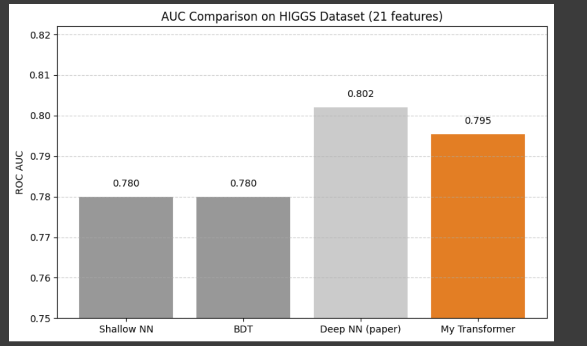

# Common Task: HIGGS Dataset Classification with Transformer Autoencoder

## Dataset:
- **Source**: [UCI HIGGS Dataset](https://archive.ics.uci.edu/ml/datasets/HIGGS)
- **Loaded via Google Drive** from `HIGGS 2.csv.gz`
- **Used data**: First **1.1 million events** with **21 features** and **1 label**.

## Preprocessing:
- **Label extraction**: Column 0 is extracted as the label.
- **Feature extraction**: Columns 1-21 are used as features.
- **Data type**: Converted features to `float32` for compatibility with PyTorch.

## Solution Overview

### Data Split:
- **Train**: 900,000 samples
- **Validation**: 100,000 samples
- **Test**: Final 100,000 samples (held out)
- Split done using `train_test_split` with `random_state=42` for reproducibility.

### Model Architecture:
- **Encoder**: Transformer encoder maps 21 features into a latent vector.
- **Decoder**: Feedforward classifier built on top of the latent space.
- Chosen for its ability to capture complex feature interactions through attention mechanisms.

### Training Setup:
- **Loss Functions**:
  - **Focal Loss** to address class imbalance.
  - **Smooth BCE** with ε=0.1 for label smoothing.
- **Optimizer**: AdamW for weight decay.
- **Scheduler**: OneCycleLR for learning rate control.
- **Mixed Precision**: Enabled via `torch.cuda.amp` and `GradScaler` for numerical stability and speed.
- **Early Stopping**: Based on validation ROC-AUC with patience set to 3 epochs.

### Training Tricks:
- **Label Smoothing** to reduce model overconfidence and improve generalization.
- **OneCycleLR** to adaptively control the learning rate during training.
- **Gradient Scaling** for numerical stability with mixed precision.

### Evaluation:
- **ROC-AUC** is tracked per epoch on the validation set.
- **Best Model**: The best model is saved as `best_transformer_model.pt`.
- Final classifier is tested on the 100,000 held-out samples.
- - **Best Validation AUC**: 0.7954.
- **AUC-vs-Epoch Curve**: Shows the performance of the model across training epochs.

### Graphs:
1. **AUC-vs-Epoch Curve**:  
     
   *This graph shows the ROC-AUC score at each epoch during training.*

2. **ROC graphs wrt the [paper](https://arxiv.org/pdf/1402.4735.pdf)**:  
     
   *This graph visualizes the ROC curve of the best model evaluated on the validation set.*

## Model:
- **Pre-trained Model**: You can access the pre-trained model here: [Google drive link](https://drive.google.com/file/d/1J8DqpHLL6e-H8NeEIjiekoj9C3gds10k/view?usp=sharing)

## Notes:
- Transformer models are highly effective in handling structured tabular data through attention-based encoding.
- The latent representations obtained from the encoder are used as input for classification.
- This setup aims to benchmark performance against the original HIGGS paper.

## To Do:
- Continue refining the model based on testing and results from the validation set.
- Explore additional hyperparameter optimization strategies to further improve performance.

